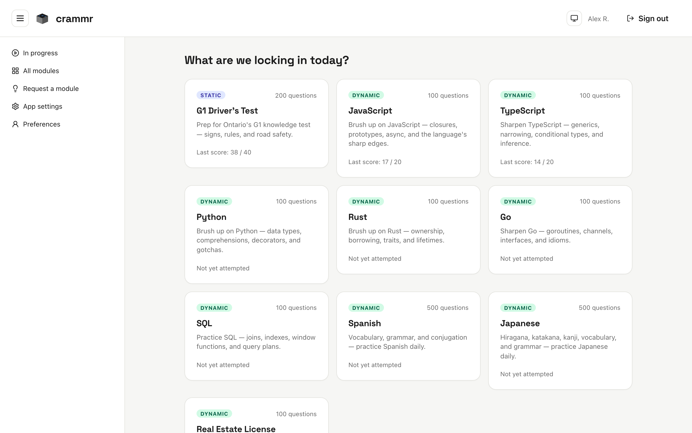
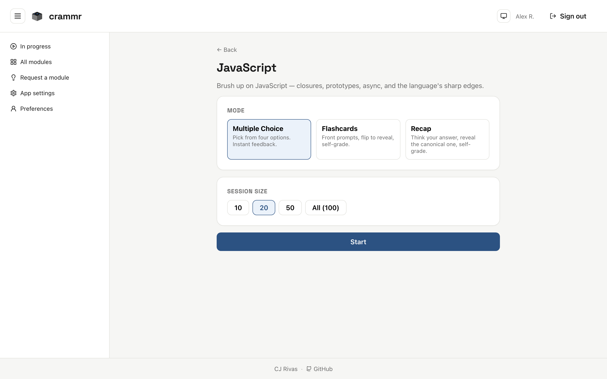
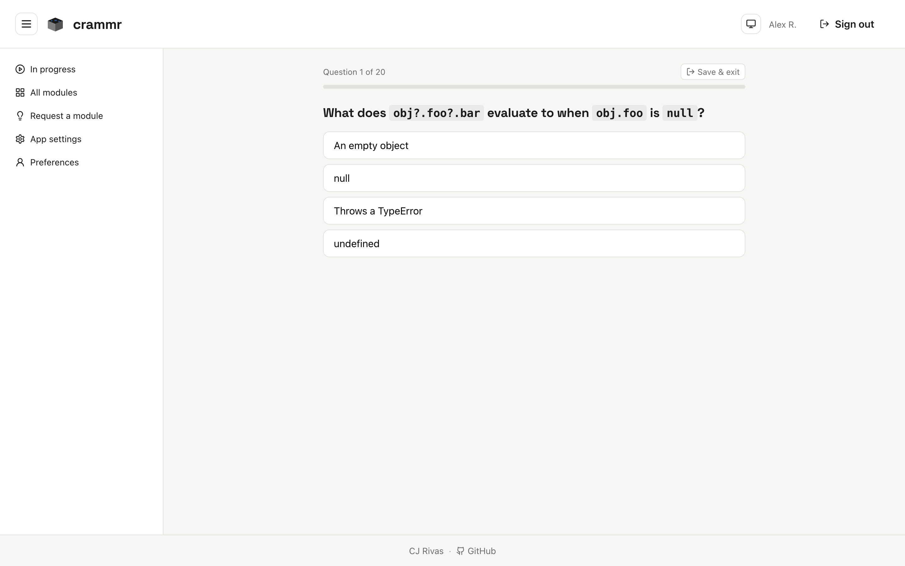

# crammr

Brush up on a skill or topic right before a test, so the material is fresh
in your mind. Pick a module, pick a mode, work through a quick session.

## Screenshots



The home page lists available modules with your last score on each.



Each module page lets you choose a mode (multiple choice, flashcards, recap)
and a session size before you start.



Quiz sessions track progress and let you save and exit at any time.

## Modules

18 modules across four categories:

- **Driving licensing** — G1 (Ontario)
- **Programming languages** — JavaScript, TypeScript, Python, C, C++, Java,
  C#, SQL, Go, Rust
- **Test prep** — Real Estate License
- **Languages** — English, Spanish, French, Japanese, Italian, Portuguese

Each module supports three **modes**:

- **Multiple choice** — pick from four options, instant feedback.
- **Flashcards** — front prompts, flip to reveal, self-grade.
- **Recap** — think your answer, reveal the canonical one, self-grade.

Dynamic modules let you choose a session size (10, 20, 50, or all); static
modules always use the full question bank.

## Stack

Bun · Vite · React + TypeScript · wouter · zustand · CSS modules ·
Supabase (Postgres + Auth + RLS) · Vitest.

## Setup

1. Install dependencies:
   ```
   bun install
   ```
2. Create a Supabase project at <https://supabase.com/dashboard>.
3. Create `.env.local` at the repo root with:
   ```
   VITE_SUPABASE_URL=https://xxxx.supabase.co
   VITE_SUPABASE_ANON_KEY=<anon key>
   SUPABASE_DB_URL=postgres://postgres.<ref>:<password>@<host>:5432/postgres
   ```
   `SUPABASE_DB_URL` comes from Dashboard → Project Settings → Database →
   Connection string (URI, with password). Only needed for `bun run db:apply`.
4. Apply migrations. Three options, pick one:
   - **`bun run db:apply`** — runs every `supabase/migrations/*.sql` via
     `psql` in sort order. Requires `psql` on PATH (`brew install libpq` and
     add to PATH, or `brew install postgresql`). Pass file paths to apply a
     subset, e.g. `bun run db:apply supabase/migrations/001_init.sql`.
   - **Supabase SQL Editor** — paste each file manually. Useful if you only
     want a subset of seeds; each `_seed_*.sql` is independent.
   - **`bun run db:push`** — uses the Supabase CLI. One-time setup:
     `brew install supabase/tap/supabase && supabase login && supabase link
--project-ref <ref>`. Migration filenames must be renamed to
     `YYYYMMDDHHMMSS_name.sql` for the CLI to detect them.

   For a fresh project, apply `001_init.sql` and `005_module_requests.sql`
   plus any `_seed_*.sql` modules you want.

5. Run the dev server:
   ```
   bun run dev
   ```

## Specs and plans

Design specs and implementation plans for in-flight work live in
`docs/superpowers/specs/` and `docs/superpowers/plans/`. Once a feature ships,
its spec and plan are archived to the crammr workspace in Notion and removed
from the repo, so `docs/superpowers/` only ever holds work that hasn't landed
yet. Archived so far: v1, Vitest setup, and the `modules.kind` property.

## Claude Code skills

Repo-local skills live in `.claude/skills/` and are picked up automatically by
Claude Code when working in this repo.

| Skill                | What it does                                                                                                                                                                                                                                                                                                                                                                         | How it's triggered                                                                                                                                                      |
| -------------------- | ------------------------------------------------------------------------------------------------------------------------------------------------------------------------------------------------------------------------------------------------------------------------------------------------------------------------------------------------------------------------------------ | ----------------------------------------------------------------------------------------------------------------------------------------------------------------------- |
| `commit-format`      | The house style for commit messages: mandatory `CRMR:` subject prefix, terse bulleted bodies, backticks around every file/function/identifier, and zero AI-agent attribution (no `Co-Authored-By: Claude` trailers, ever).                                                                                                                                                           | Whenever a commit message is written or rewritten in this repo — commit, amend, squash, fixup, rebase, or cherry-pick.                                                  |
| `pr-format`          | The house style for pull requests: mandatory `CRMR:` title prefix, flat bulleted body derived from the branch's commits, a fixed section set (`Changes`, `Breaking changes`, `Test notes`, `Follow-ups`) used only past ~8 bullets, never a `Verification` section, backticks around every code token, and zero AI-agent attribution (no "Generated with Claude Code" footer, ever). | Whenever a PR is opened, retitled, or its body rewritten in this repo — `gh pr create`, `gh pr edit`, or drafting PR text to paste.                                     |
| `module-level-split` | The procedure for splitting a single 100-question quiz module into three difficulty-level modules (`<lang>-1/2/3`, displayed as `<Lang> — Level 1/2/3`): per-question classification, the SQL seed transform, companion-file updates (`moduleCategories.ts`, screenshot fixtures), and verification.                                                                                 | Requests like "split the X module into level 1/2/3" or "break up the Y module by difficulty", matching the pattern already used for JavaScript, TypeScript, and Python. |

## Regenerating screenshots

`scripts/capture-screenshots.ts` drives Chromium (Playwright) against the dev
server and writes PNGs to `docs/screenshots/`. It bypasses Supabase by
injecting a synthetic auth session and mocking PostgREST responses, so it
works without real credentials.

```
bun run dev                               # in one terminal
bun run scripts/capture-screenshots.ts    # in another
```
